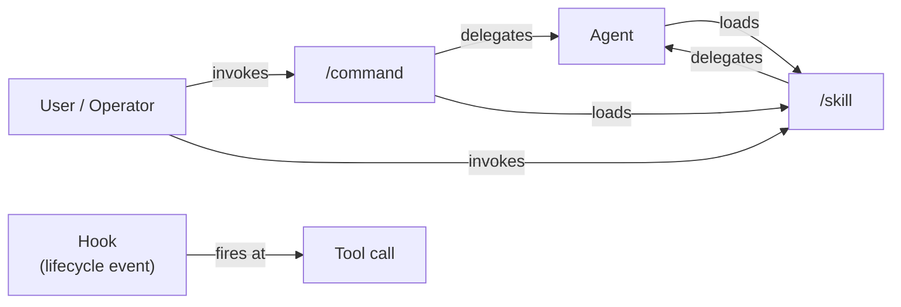
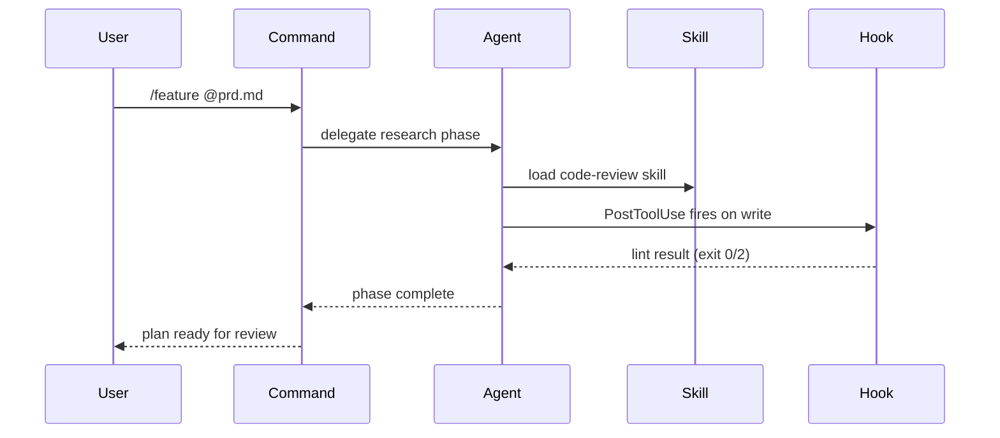

# Module 3: Extending Claude Code — Commands, Skills, Hooks, and Agents

In this module we use Claude to generate a visual reference document for the ADW
system already present in this branch, then explore the `.claude/` scaffolding that
powers it: phase commands, a reusable skill, and a session capture hook. We close
by using session logs to analyze agent behavior and improve ADW velocity.

---

## Key Concepts

| Term | Definition |
|------|-----------|
| **ARD (Architecture Reference Document)** | A technical reference that describes how a system is designed. We use Mermaid diagrams to make it visual and navigable. |
| **Mermaid** | A text-based diagramming syntax that renders inside Markdown. Write diagram definitions as code; get flowcharts, sequence diagrams, and state machines as output. |
| **Custom slash command** | A user-defined command stored in `.claude/commands/<name>.md`. Explicitly invoked with `/<name>`. Claude executes the markdown as a prompt template. |
| **Skill** | A reusable capability stored in `.claude/skills/<name>/SKILL.md`. Claude loads it automatically when the task matches the skill's description — no explicit invocation needed. |
| **Custom subagent** | A user-defined agent at `.claude/agents/<name>.md` with YAML frontmatter (model, tools, permissions) and a system prompt body. Extends the built-in subagent types with project-specific roles — such as a code reviewer restricted to read-only tools. |
| **Hook** | A script that runs at a Claude Code lifecycle event (e.g. `PreToolUse`, `PostToolUse`, `Stop`). Configured in `.claude/settings.json`. Used for validation, logging, and back pressure. See [hook events](https://code.claude.com/docs/en/hooks#hook-events). |
| **Context engineering** | Intentionally shaping what's in the context window to improve Claude's output — what to include, what to exclude, and when to reset. CLAUDE.md, skills, hooks, and subagents are all context engineering tools. |
| **Dynamic context injection** | Providing Claude with relevant context at the moment it's needed — via hooks, skills, or CLAUDE.md — rather than up front in every prompt. A specific context engineering technique. |
| **Progressive disclosure** | Surfacing information incrementally: start with a summary, reveal detail on demand. Prevents overwhelming agents and users with irrelevant context. |
| **Prompt-driven orchestration** | Composing a multi-step workflow through prose instructions in a command or skill. Single-agent commands execute phases sequentially; team commands coordinate parallel specialist workers — both defined in markdown, no code required. |
| **Team orchestration** | Composing a multi-step workflow through an agent team where a leader coordinates specialist workers via `TeamCreate`, `TaskCreate`, and `SendMessage`. Parallel where possible, prompt-driven, and defined in a slash command. |
| **JSONL** | JSON Lines — one JSON object per line. Claude Code session transcripts are stored in this format, making them easy to stream and parse. |

---

## Tools in this module

**Built-in tools**

| Tool | What it does |
|------|-------------|
| `Read` | Reads a file from the filesystem |
| `Write` | Creates a new file |
| `Edit` | Makes targeted edits to an existing file |
| `Glob` | Finds files by pattern (e.g. `**/*.md`) |
| `Bash` | Runs a shell command |

**Team tools**

| Tool | What it does |
|------|-------------|
| `TeamCreate` | Creates a named team with a shared task list |
| `TaskCreate` | Adds a task to the current team's task list |
| `TaskUpdate` | Updates task owner and status |
| `SendMessage` | Sends messages between team members |

---

## 1. Generate the ADW Architecture Reference Document

Before exploring the scaffolding, let's use Claude to produce a visual map of it.
This is a demonstration of Claude as a documentation tool — no code required.

In the chat box, enter:

```markdown
Read the `.claude/` directory, then generate a comprehensive Architecture Reference Document at `docs/adr/adw.md`.
Include the following Mermaid diagrams:

1. Feature and bug workflow phase sequences (flowchart)
2. Python orchestrator chaining pattern (sequence diagram)
3. ADW component architecture showing the .claude/ directory structure (architecture diagram)
4. ADW state lifecycle from creation to completion (state diagram)
5. State JSON schema (entity relationship diagram)
```

Claude will read the existing files, reason about the system design, and produce a
structured document with all five diagrams.

> **What just happened?** Claude read existing files and produced a technical
> reference — no code was written. This is the same capability that makes Claude
> useful for generating PRDs, ADRs, runbooks, and onboarding docs from existing
> codebase knowledge. The Mermaid diagrams render directly in GitHub, VS Code, and
> most markdown viewers.

Review `docs/adr/adw.md` before continuing. You'll be referencing it throughout this
module and the next.

---

## 2. Skills vs Commands

Before exploring the `.claude/` scaffolding, it's worth understanding the structural
difference between the two primary extension mechanisms.

**Skills are capability bundles.** A skill is a directory — `.claude/skills/<name>/` —
containing a `SKILL.md` file with YAML frontmatter and instructions, plus optional
`references/` subdirectory, scripts, and templates. Claude reads skill descriptions
and decides whether to load one based on the current task — skills are not triggered
automatically like hooks. The `description` field in a skill's YAML frontmatter is
the primary signal Claude uses to make this decision. Think of them as "know this when
relevant": coding standards, domain knowledge, architectural context, or how to operate
a tool. In this repo:

- `.claude/skills/code-review/SKILL.md` — auto-loaded when Claude is doing code review
- `.claude/skills/documentation-standards/` — has a `references/templates.md` file with doc templates

> **Skills are the right place to teach Claude how to use CLI tools.** When your project
> uses a custom CLI (like `todd`, `bb.py`, or a deployment tool), a skill can bundle the
> command reference, common flags, and usage patterns that Claude needs to operate it
> correctly. Because skills load when the task matches, Claude gets the tool knowledge
> exactly when it's about to use it — not on every turn.

> **Writing effective skill descriptions.** A skill is only as discoverable as its
> description. Be specific about *when* the skill applies — "MUST BE USED when
> reviewing code" is stronger than "helps with code review." Include trigger phrases
> Claude will see in user prompts. If your skill isn't firing when expected, the
> description is the first thing to check.

**Commands are focused workflows.** A command is a single markdown file at
`.claude/commands/<name>.md`. It acts as a prompt template for a reproducible action.
You invoke it explicitly with `/<name>`. Think of them as "do this specific thing":
implement a feature, research a topic, run a phase. In this repo:

- `.claude/commands/implement.md` — the explicit `/implement` workflow

> **Commands and skills have merged.** A file at `.claude/commands/review.md` and a
> file at `.claude/skills/review/SKILL.md` both create a `/review` command. Commands
> still work, but skills are the superset — they can do everything a command can, plus
> bundle supporting files, reference material, and scripts alongside the instructions.

The distinction in practice:

**Diagram 1: Extension point overview**



**Diagram 2: Execution flow**



| | Command | Skill |
|-|---------|-------|
| **Invocation** | Explicit (`/research`, `/implement`) | Automatic (description match) |
| **Structure** | Single `.md` file | Directory (`SKILL.md` + optional `references/`, scripts) |
| **Use case** | Phase execution, defined workflows | Standards, guidelines, domain knowledge |
| **Location** | `.claude/commands/<name>.md` | `.claude/skills/<name>/SKILL.md` |
| **Good for** | "Do this specific thing" | "Know this when doing related things" |
| **Frontmatter** | `description`, `context`, `agent`, `allowed-tools` | `disable-model-invocation`, `context: fork`, `allowed-tools` |

> **Command frontmatter fields:**
>
> | Field | Effect |
> |-------|--------|
> | `description` | Short text shown in the slash-command picker. Also helps Claude decide relevance. |
> | `context: fork` | Runs the command in a forked conversation — output doesn't pollute your main context. All seven phase commands use this. |
> | `agent` | Delegates execution to a custom agent in `.claude/agents/`. The command file becomes the agent's prompt. |
> | `allowed-tools` | Restricts which tools are available during command execution. |
>
> Example from `/implement`:
> ```yaml
> ---
> description: Implement a plan using TDD methodology with atomic commits per phase
> context: fork
> agent: implementation
> ---
> ```

> **Skills can behave exactly like commands.** Set `disable-model-invocation: true`
> in a skill's frontmatter to prevent auto-loading — it will only run when the user
> invokes it via `/skill-name`. Add `context: fork` to run it in an isolated subagent
> (useful for workflows that shouldn't pollute the main context). This gives you
> command-style explicit invocation with skill-level bundled references and scripts.

**When to use what:**

| If you want to... | Use |
|-------------------|-----|
| Execute a repeatable workflow | **Command** |
| Teach Claude domain knowledge | **Skill** |
| Coordinate a calibrated specialist | **Agent** |
| Validate output automatically | **Hook** |

> **Practical decision tree.** If it's a workflow → command. If it's knowledge → skill.
> If it's a calibrated specialist → agent. If it's a quality gate → hook.
> Agents can invoke commands (e.g. an orchestrator agent running `/implement`).
> Commands can delegate to agents (e.g. `/team:feature` spawning worker agents).

> **Agents as calibrated skillsets.** An agent isn't just "a specialist worker" — it's
> a worker whose capabilities are explicitly scoped. You control:
> - **Tools** — which tools the agent can use (via `allowed-tools` frontmatter)
> - **Model** — which model runs the agent (via `model` frontmatter)
> - **Knowledge** — what domain context it receives (the agent file's markdown body)
> - **MCP access** — which MCP servers are available (via `mcp-servers` frontmatter)
>
> A narrowly scoped agent (e.g. `validation` with read-only tools) is safer and
> cheaper than a general-purpose one. Start narrow — you can always widen scope later.
> When choosing between "just use Claude directly" and "create an agent," ask: does
> this task benefit from restricted tools, a specific model, or domain-specific
> instructions? If yes, it's an agent. If no, a command or direct prompt is simpler.

> **Four ways to deliver work.** The phase commands are reusable primitives.
> You can compose them in four ways — two single-agent, two multi-agent:
>
> 1. **`/feature`** — single-agent, sequential, all 7 phases
> 2. **`/bug`** — single-agent, sequential, 6 phases (no design)
> 3. **`/team:feature`** — multi-agent, parallel analysis then coordinated
>    implementation, all 7 phases
> 4. **`/team:bug`** — multi-agent, parallel analysis then coordinated
>    implementation, 6 phases (no design)
>
> A PRD at `docs/prds/adw-commands.md` defines all four commands we'll build
> in this module using prompt-driven orchestration.

### The Seven Phase Commands

These are the building blocks you'll chain into delivery workflows in Module 4.
Each command runs in a forked context (`context: fork`) so it doesn't pollute your
main conversation.

| Command | What it does | Delegates to |
|---------|-------------|-------------|
| `/research` | Decomposes a question into sub-questions, spawns parallel Explore subagents, and synthesises findings into a research report. | Explore subagents (Haiku) |
| `/design` | Reads requirements and produces a technical spec covering architecture, components, interfaces, data models, and risks. | Plan subagent |
| `/plan` | Turns a spec into a phased implementation plan where each phase is one atomic commit with files, test strategy, and acceptance criteria. | Plan subagent |
| `/validation` | Validates a plan's structure (PHASE-NNN identifiers, atomicity, conventional commits) and traceability to specs. Returns READY / NOT READY / NEEDS REVISION. | `validation` agent |
| `/implement` | Executes a plan using TDD (Red → Green → Refactor), runs quality checks (pytest, ruff, mypy) after each phase, and creates one atomic commit per phase. | `implementation` agent |
| `/review` | Multi-dimensional code review — quality (ruff, mypy, xenon), security (bandit), tests, and documentation — with severity ratings and an APPROVE / REQUEST_CHANGES recommendation. | `validation` agent |
| `/document` | Analyses implementation changes, identifies affected docs, and updates them following documentation-standards conventions. | `documentation` agent |

> **Notice the delegation pattern.** The first three commands (`/research`,
> `/design`, `/plan`) delegate to built-in subagent types (Explore, Plan) using
> inline Agent tool calls. The last four delegate to custom agents defined in
> `.claude/agents/` via the `agent:` frontmatter key. You'll see both patterns
> as you build your own extensions.

---

> **Internal Plugin Marketplace.** Your team maintains an internal marketplace
> of Claude Code plugins. These plugins provide pre-built commands, skills,
> and agents for common workflows — including code review, Jira integration,
> security hooks, and orchestration patterns. Your instructor will walk you
> through how to access and install them.

---

## 3. Install the Skill Creator

The `document-skills` plugin from the Anthropic marketplace includes
`skill-creator` — a guided skill that walks you through building new skills
with correct frontmatter and structure.

In the chat box, run:

```
/plugin
```

Browse to the **Discover** tab, find **document-skills** from the
`anthropic-agent-skills` marketplace, and install it at **project** scope.

> **The skill marketplace.** Claude Code supports shared skills distributed
> through marketplaces. The `anthropic-agent-skills` marketplace is maintained
> by Anthropic and includes productivity skills (document processing, frontend
> design) and meta-skills (skill-creator, MCP builder). Installing a plugin
> gives Claude access to the skills it contains — they appear in the `/` menu
> and Claude can load them automatically by description match.

---

## 4. Custom Subagents

In Module 2 you saw built-in subagents (Explore, Plan, General-purpose). Now you'll
create your own.

**Anatomy of a custom subagent.** Each agent lives at `.claude/agents/<name>.md` and
consists of YAML frontmatter plus a system prompt body:

```yaml
---
name: code-reviewer
description: Read-only code reviewer for style and correctness analysis
model: sonnet
tools:
  - Read
  - Glob
  - Grep
permissionMode: default
maxTurns: 10
skills:
  - code-review
---

You are a code reviewer. Analyze the provided code for:
- Correctness and potential bugs
- Style consistency with project conventions
- Type annotation completeness
- Test coverage gaps

Report findings as a structured list with file:line references.
Do not suggest fixes — only identify issues.
```

> **Model selection matters.** Haiku is fast and cheap but designed for
> exploration and search — not analysis. Code review requires reasoning about
> correctness, patterns, and edge cases. Use sonnet or opus for analytical
> agents. Reserve haiku for agents that primarily search and retrieve.

**Frontmatter fields:**

| Field | Purpose | Example values |
|-------|---------|---------------|
| `name` | Display name | `code-reviewer` |
| `description` | When Claude should delegate to this agent | Free text |
| `model` | Which model to use | `sonnet`, `opus`, `haiku` |
| `tools` | Allowlist of available tools | `[Read, Glob, Grep]` |
| `permissionMode` | Permission level | `default`, `bypassPermissions` |
| `maxTurns` | Maximum agentic turns | `10`, `20` |
| `skills` | Skills to preload | `[code-review]` |
| `memory` | Memory scope | `user`, `project`, `local` |
| `isolation` | Execution isolation | `worktree` |

> See the full [agent settings reference](https://code.claude.com/docs/en/agents)
> for all available frontmatter fields.

> **Exercise:** Create `.claude/agents/code-reviewer.md` with the configuration above.
> Then ask Claude to "review the todd query command" and observe it delegating to your
> custom subagent.

> **Exercise 2:** Ask Claude to create a design agent:
> ```
> Create .claude/agents/design.md — a design agent with model: opus, tools: Read,
> Glob, Grep, Write, and the documentation-standards skill. The agent should produce
> technical specifications for features based on PRDs and research findings.
> ```
> Notice that Claude creates the agent file itself — this is Claude building its own
> tooling. Review the generated frontmatter and system prompt before continuing.


### Agent MCP Scoping

When an agent needs an MCP server, there are two patterns depending on whether the
server requires OAuth authentication.

**Pattern 1 — Inline `mcpServers` (local/stdio servers, no OAuth)**

Use this for servers that start as a local process (stdio transport). The agent
defines the server in its own frontmatter and gets its own instance:

```yaml
---
name: docs-researcher
description: Researches documentation using Context7
model: haiku
tools:
  - Read
  - mcp__context7__resolve-library-id
  - mcp__context7__query-docs
mcpServers:
  context7:
    command: "npx"
    args: ["-y", "@upstash/context7-mcp@latest"]
---
```

The server starts fresh for this agent. No authentication flow needed — works in
subagents, `claude -p`, and team workers.

**Pattern 2 — Plugin inheritance (OAuth-based servers)**

For servers like Atlassian or Slack that require browser-based OAuth consent, omit
`mcpServers` entirely. The agent inherits the parent session's plugin connections
automatically. Use `tools` to control which MCP tools the agent can call:

```yaml
---
name: jira-analyst
description: Searches and retrieves Jira issues
model: sonnet
tools:
  - Read
  - Grep
  - mcp__plugin_jira_atlassian__searchJiraIssuesUsingJql
  - mcp__plugin_jira_atlassian__getJiraIssue
---
```

> **Why inline fails for OAuth.** Each inline `mcpServers` definition creates a new
> OAuth client registration. Subagents run in-process and cannot open a browser tab
> to complete the consent flow. The plugin system solves this by authenticating once
> (in your main session) and sharing that authenticated connection with all in-process
> agents. Use inline only for stdio servers; let plugins handle OAuth.

You'll see three more agents (implementation.md, validation.md, documentation.md)
when you explore the `.claude/` scaffolding in the next section.


### Sandboxing and Controlled Autonomous Builds

When giving agents `bypassPermissions` or running autonomous builds, you want a
safety net. Claude Code provides two complementary sandboxing mechanisms:

**1. `/sandbox` — OS-level sandboxing**

Enable via the `/sandbox` slash command or in `settings.json`:

```json
{
  "sandbox": {
    "enabled": true,
    "autoAllowBashIfSandboxed": true,
    "network": {
      "allowedDomains": ["pypi.org", "*.pythonhosted.org", "github.com"]
    }
  }
}
```

On macOS this uses Seatbelt; on Linux, bubblewrap. It restricts the Bash tool to
write only within your working directory and to network only to approved domains.

`autoAllowBashIfSandboxed: true` removes per-command permission prompts — because
the OS already enforces the boundary, the human approval gate adds friction without
adding safety. The result: Claude runs shell commands at full speed while the
sandbox quietly enforces limits.

**2. Worktree isolation — git-level sandboxing for agents**

Add to any agent's frontmatter:

```yaml
isolation: worktree
permissionMode: bypassPermissions
```

The agent works in a separate git worktree — its file changes are invisible to your
main branch until you explicitly merge them. If the output is bad, discard the
worktree. If it's good, merge.

CLI equivalent: `claude -w my-worktree --dangerously-skip-permissions`

**Isolation layers at a glance:**

| Layer | Mechanism | What it protects | Speed trade-off |
|-------|-----------|-----------------|----------------|
| **OS sandbox** | `/sandbox` (Seatbelt/bwrap) | Filesystem + network | Auto-allow bash |
| **Worktree** | `isolation: worktree` | Git-level file isolation | Discard bad output |
| **Tools** | `tools` allowlist | Available actions | Read-only agents |
| **Permissions** | `permissionMode` | User approval gates | Bypass when sandboxed |
| **Context** | Subagent boundary | Fresh context window | Prevents rot/poisoning |

> **The pattern:** Sandbox + bypass permissions = fast autonomous builds within a
> controlled blast radius. The sandbox (OS or worktree) provides the safety net;
> `bypassPermissions` or `autoAllowBashIfSandboxed` removes the speed bump. This is
> exactly how the orchestrators in Module 5 achieve speed without risk.

**When to use each:**
- `/sandbox`: Interactive sessions, CI, any context where OS-level enforcement matters
- Worktree: Parallel agent work, team orchestration, discardable experiments
- Both together: Maximum safety for autonomous multi-agent builds

You'll see isolation layers running at scale in Module 5.

---

## 5. Explore the Lint Check Hook

Hooks run at Claude Code lifecycle events. A `PostToolUse` hook fires after every
`Write` or `Edit` tool call — the right moment to validate what Claude just wrote
before it moves on.

> **Available hook events** include `PreToolUse` (block before execution),
> `PostToolUse` (validate after execution), `Notification`, `Stop`,
> `SubagentStart`/`SubagentStop`, `SessionStart`, and more. See the
> [hook events reference](https://code.claude.com/docs/en/hooks#hook-events)
> for the complete list.

Enter this prompt:

```markdown
Read `.claude/hooks/lint-check.py` and `.claude/settings.json`. Explain: what the
PostToolUse hook does, when it fires, what it runs, and what happens when a check
fails.
```

> **Back pressure via hooks.** When the hook exits 2, Claude receives the error output
> and must fix the issue before continuing. This is back pressure — the system
> actively resists bad output rather than silently accepting it. Claude can't drift
> from quality standards because the hook closes the loop immediately after every file
> write. This is how hooks enforce constraints without adding them to every prompt.

---

## 6. Understanding Dynamic Context Injection

You've now explored three mechanisms for injecting context into Claude:

| Mechanism | When it fires | Use case |
|-----------|--------------|----------|
| `CLAUDE.md` | Every session, always | Project-wide constants: tech stack, conventions, goals |
| **Skill** | When task matches description | Cross-cutting standards loaded on demand |
| **Hook** | At lifecycle events | Validation, back pressure, enforcing quality gates |

Together these form a layered context system. `CLAUDE.md` is the foundation — always
present. Skills add domain knowledge when it's relevant. Hooks fire at specific
moments to inject or capture context dynamically.

> **Progressive disclosure applied here.** We don't put everything in `CLAUDE.md`
> because not every task needs every piece of context. A code quality skill doesn't
> need to load when Claude is writing documentation. A hook that injects the current
> ADW state only fires during a workflow run. Context is revealed at the moment it's
> needed — no earlier, no later.

---

## 7. CLAUDE.md as a Context Engineering Tool

You've now seen CLAUDE.md as project-level configuration. It's also a powerful context
engineering tool with several advanced features.

> **Tip:** Use `/memory` to see all loaded memory files and their sources. Auto-memory
> (`~/.claude/projects/<project>/memory/`) stores Claude's learnings across sessions —
> the first 200 lines of `MEMORY.md` load automatically at startup.

**Import syntax** — use `@path/to/file` inside CLAUDE.md to pull in content from other
files. This lets you maintain shared rules, tech stack details, or architecture decisions
in separate files while keeping CLAUDE.md as the entry point.

> **Markdown links for progressive disclosure.** Instead of inlining all context,
> use markdown links to reference deeper documentation:
> ```markdown
> # Architecture
> See [ADW Architecture](docs/adr/adw.md) for the full architecture reference.
> See [API Conventions](docs/api-conventions.md) for endpoint patterns.
> ```
> Claude follows links when the current task needs that context — it won't load
> the architecture reference when fixing a typo. This keeps CLAUDE.md concise
> while making deep context available on demand. The `@import` syntax always
> includes content inline; markdown links let Claude choose when to drill down.

**`.claude/rules/` directory** — path-specific rules that apply only to matching
directories. For example, a rule for `src/` that enforces typing conventions won't
fire when Claude is editing test files.

| File | Applies to |
|------|-----------|
| `.claude/rules/src.md` | Files under `src/` |
| `.claude/rules/tests.md` | Files under `tests/` |
| `.claude/rules/docs.md` | Files under `docs/` |

**`CLAUDE.local.md`** — personal overrides not committed to git. Use for
individual editor preferences, personal workflow notes, or debugging flags that
shouldn't affect teammates.

**`settings.local.json`** — the same pattern for settings. Local overrides that don't
affect the team configuration.

**Team conventions** — the project CLAUDE.md serves as a team contract. Shared standards
(tech stack, commit conventions, code style) go in the committed CLAUDE.md. Personal
preferences (verbosity, editor, shortcuts) go in `CLAUDE.local.md`.

> **Exercise:**
> 1. Create `.claude/rules/src.md` with a rule about error handling for `src/`
>    files (e.g., "Functions in src/ should raise `TypeError` or `ValueError`
>    for invalid arguments — never silently return `None`. Use the patterns
>    established in existing modules.")
> 2. Add an `@docs/adr/adw.md` import to the project CLAUDE.md so Claude always has the
>    ADW architecture reference
> 3. Create a `CLAUDE.local.md` with a personal preference (e.g., preferred
>    verbosity level or a debugging note)

> **Callout:** CLAUDE.md, skills, hooks, and `rules/` form a four-layer context system.
> CLAUDE.md is always-on, `rules/` are path-scoped, skills are task-scoped, and hooks are
> event-scoped. Together they let you shape Claude's behavior precisely without
> overloading any single mechanism.

**Anti-patterns to watch for:**

| Anti-pattern | Problem |
|-------------|---------|
| Too long (>200 lines) | Noise drowns out signal; Claude gives less weight to each instruction |
| Contradictory instructions | Claude picks one arbitrarily; behavior becomes unpredictable |
| Stale file references | Claude tries to read files that no longer exist |
| Vague directives ("be careful") | No actionable constraint; Claude ignores them |

**Maintenance checklist** — run through this after significant project changes:

- [ ] Are all referenced files still present?
- [ ] Are tool and command names current?
- [ ] Are there conflicting instructions?
- [ ] Is the tech stack accurate?
- [ ] Are test commands still correct?
- [ ] Do coding standards match what's actually enforced?

Treat CLAUDE.md like any other config file: small investments in accuracy pay off
across every session.

### Prompt Engineering Fundamentals

We've covered *where* to put context (CLAUDE.md, command files, hooks) and *when* it
loads — now let's cover *how* to write effective prompts and format the content within
those files.

**Core principles:**

1. **Be specific** — "Write a Python function that validates email addresses using
   regex" beats "write a validator." Constraints reduce guessing.
2. **Provide context** — tell Claude *why* you need something, not just *what*. "This
   runs in a Lambda with a 512 MB memory limit" shapes better answers than silence.
3. **Show examples** — a single input/output example is worth paragraphs of
   description. Use few-shot patterns when output format matters.
4. **Set constraints** — explicit boundaries ("do not modify files outside `src/`",
   "keep the response under 50 lines") prevent scope creep.

> **Prompt engineering evolves with the model.** Claude 4.6 requires less scaffolding
> than earlier generations — it follows instructions more reliably, handles ambiguity
> better, and needs fewer examples to understand a pattern. Techniques that were
> essential for Claude 3.5 (heavy XML wrapping, exhaustive few-shot examples) may now
> be optional. Start simple; add structure only when Claude's output drifts from what
> you need.
>
> See Anthropic's latest guidance:
> [docs.anthropic.com/en/docs/build-with-claude/prompt-engineering/overview](https://docs.anthropic.com/en/docs/build-with-claude/prompt-engineering/overview)

#### Structuring with XML Tags

Anthropic recommends XML tags for structuring prompts with unambiguous boundaries.
Claude parses XML tags natively. Unlike markdown headers, which can blur section
boundaries in complex prompts, XML tags make structure explicit and machine-readable.

#### Common tag patterns

```xml
<instructions>What to do</instructions>
<context>Background information</context>
<examples>Few-shot demonstrations</examples>
<input>The variable content to process</input>
<constraints>Boundaries and limitations</constraints>
```

#### When to use XML vs markdown

| Format | Best for |
|--------|----------|
| Markdown | Human-readable docs: CLAUDE.md, module content, READMEs |
| XML tags | Structured agent prompts, skill instructions, command templates where unambiguous section boundaries matter |

Use markdown when humans are the primary reader. Use XML when the agent is the primary reader.

#### Exercise

Open an existing command or skill file (e.g., `.claude/commands/research.md`) and identify where XML tags could improve clarity. Look for sections that blend instructions, context, and variable input — these are the best candidates for XML structure.

> **Reference**: Anthropic's prompt engineering guide — [Use XML tags to structure your prompts](https://docs.anthropic.com/en/docs/build-with-claude/prompt-engineering/use-xml-tags)
---

## 8. Enable Agent Teams

Agent teams let you coordinate multiple Claude instances working in parallel on a
shared task list. A team leader assigns work; specialist workers execute concurrently
and report back.

**Enable the feature flag** in `.claude/settings.json`:

```json
{
  "env": {
    "CLAUDE_CODE_EXPERIMENTAL_AGENT_TEAMS": "1"
  }
}
```

Or export it in your shell: `export CLAUDE_CODE_EXPERIMENTAL_AGENT_TEAMS=1`

**Team tools overview:**

| Tool | What it does |
|------|-------------|
| `TeamCreate` | Creates a team with a shared task list |
| `TaskCreate` | Adds a task to the team's task list |
| `TaskUpdate` | Updates task status (pending → in_progress → completed) |
| `SendMessage` | Sends a direct message to a teammate |

**Hands-on exercise:** Use a team to build your agents in parallel.

```
Create a team and use it to simultaneously build the code-reviewer agent (from
Exercise 1) and the design agent (from Exercise 2). Launch both agents in parallel.
```

Observe how the team leader spawns two workers, assigns them tasks concurrently, and
collects their results — rather than building each agent sequentially.

> **When teams help.** Teams shine for parallel independent tasks: two agents building
> separate files, a research agent and a coding agent running simultaneously, or
> parallel validation passes. They add overhead for sequential dependent work (where
> step B requires step A's output). Ask yourself: "Could these tasks run at the same
> time?" If yes, a team likely helps.

---

## 9. Commit and Proceed

Ask Claude to commit the changes, then advance to the next module:

```markdown
Commit the changes and then run /module to proceed to module 4.
```

---

[← Module 2](module2.md) | [Module 4 →](module4.md)
